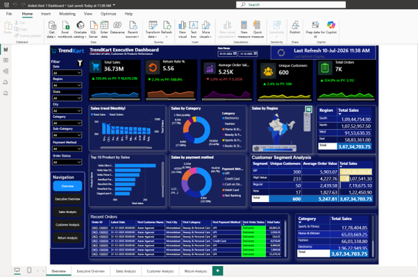

# 📊 TrendKart Sales Analytics Dashboard

An end-to-end Business Intelligence solution developed using **Microsoft Power BI** to transform raw retail sales data into interactive dashboards and actionable business insights.

This project demonstrates data cleaning, ETL using Power Query, data modeling, DAX calculations, KPI development, and dashboard design for executive reporting.

---

## 📌 Project Overview

The objective of this project is to analyze retail sales data and provide business stakeholders with a centralized dashboard to monitor:

- 📈 Sales Performance
- 👥 Customer Analytics
- 📦 Product Performance
- 🌍 Regional Performance
- 🔄 Return Analysis
- 📅 Year-over-Year Trends

The dashboard enables users to explore business performance through interactive filters and visualizations.

---

# 🖼 Dashboard Preview

## Executive Dashboard



---

## Sales Analysis


---

## Customer Analysis


---

## Return Analysis


---

# 🎯 Business Objectives

- Monitor overall sales performance
- Identify top-performing products
- Analyze customer purchasing behaviour
- Compare regional sales
- Track return rates
- Measure Year-over-Year growth
- Support business decision-making through interactive dashboards

---

# 📂 Dataset

The dashboard was built using four datasets:

| Dataset | Description |
|---------|-------------|
| Orders | Customer order transactions |
| Products | Product information and categories |
| Customers | Customer demographic information |
| Returns | Returned order records |

---

# ⚙ Data Preparation (Power Query)

Data transformation was performed using Power Query.

Cleaning steps included:

- Replacing missing values
- Removing duplicate records
- Standardizing text values
- Converting data types
- Creating custom Revenue column
- Filtering cancelled orders
- Preparing clean analytical tables

---

# 🏗 Data Model

The project uses a star-schema data model consisting of:

### Fact Table

- Orders

### Dimension Tables

- Customers
- Products
- Returns
- Calendar

A dedicated Calendar table was created to support time-intelligence calculations.

---

# 📊 Key Performance Indicators

The dashboard includes the following KPIs:

- Total Sales
- Total Orders
- Average Order Value (AOV)
- Distinct Customers
- Total Quantity Sold
- Returned Orders
- Return Rate
- Sales YTD
- Previous Year Sales

---

# 📈 Dashboard Features

### Executive Dashboard

- KPI Cards
- Sales Overview
- Monthly Sales Trend
- Regional Performance
- Product Category Analysis
- Customer Segmentation

### Sales Dashboard

- Monthly Revenue
- Category Performance
- State-wise Sales
- Product Performance

### Customer Dashboard

- Customer Segmentation
- Average Order Value
- Top Customers
- Payment Method Distribution

### Return Dashboard

- Return Rate
- Returned Orders
- Return Cost Analysis
- Regional Return Analysis

---

# 💡 Business Insights

The analysis highlighted several important business trends:

- Sales peaked during October and November.
- Electronics generated the highest revenue.
- Fashion products recorded the highest sales volume.
- The South region generated the highest revenue.
- Maharashtra was the top-performing state.
- The overall return rate was approximately 5.84%.
- Average Order Value was around ₹5.2K.
- Customer retention initiatives could help increase repeat purchases.

---

# 🛠 Technologies Used

- Microsoft Power BI
- Power Query
- DAX
- Microsoft Excel
- Data Modeling
- Business Intelligence

---

# 💼 Skills Demonstrated

- Data Cleaning
- ETL
- Power Query
- Data Modeling
- Star Schema Design
- DAX
- Time Intelligence
- KPI Development
- Dashboard Design
- Data Visualization
- Business Analysis

---

# 📁 Repository Structure

```
trendkart-sales-analytics-powerbi/
│
├── README.md
├── TrendKart_Report.pdf
│
├── assets/
│   ├── executive-dashboard.png
│   ├── sales-analysis.png
│   ├── customer-analysis.png
│   └── return-analysis.png
│
├── docs/
│   ├── Business_Objectives.md
│   ├── ETL_Process.md
│   ├── Data_Model.md
│   ├── DAX_Measures.md
│   └── Business_Insights.md
│
└── dataset/
```

---

# 🚀 Future Improvements

- Sales Forecasting
- Customer Churn Prediction
- Inventory Dashboard
- RFM Customer Segmentation
- AI-assisted Insights
- Mobile Dashboard Optimization

---

# 📄 Documentation

Additional documentation is available in the `docs` folder:

- Business Objectives
- ETL Process
- Data Model
- DAX Measures
- Business Insights

---

# 👨‍💻 Author

**Aniket Singh**

B.Tech – Artificial Intelligence & Machine Learning

### Areas of Interest

- Business Intelligence
- Data Analytics
- Machine Learning
- Power BI
- SQL

---

# 📜 Copyright

© 2026 Aniket Singh. All Rights Reserved.

This repository is published solely as a professional portfolio project.

The Power BI report, dashboard design, DAX measures, documentation, screenshots, and associated files may not be copied, modified, redistributed, or used for commercial or academic purposes without prior written permission from the author.

---

⭐ If you found this project interesting, please consider starring the repository.